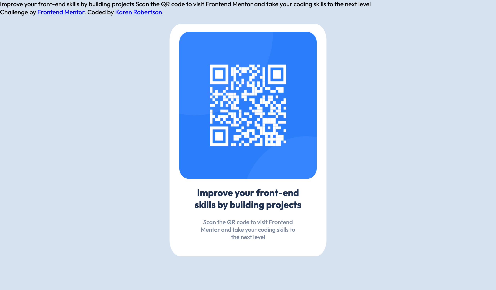

# Frontend Mentor - QR code component solution

This is a solution to the [QR code component challenge on Frontend Mentor](https://www.frontendmentor.io/challenges/qr-code-component-iux_sIO_H). Frontend Mentor challenges help you improve your coding skills by building realistic projects.

## Table of contents

- [Overview](#overview)
  - [Screenshot](#screenshot)
  - [Links](#links)
- [My process](#my-process)
  - [Built with](#built-with)
  - [Continued development](#continued-development)
- [Author](#author)

## Overview

### Screenshots

#### Desktop Version

#### Mobile Version

### Links

- Solution URL: [GitHub](https://github.com/indigorose/QR_Code_Component)

- Solution URL: [Netlify](indigorose-qrcode.netlify.app)

## My process

### Built with

- Semantic HTML5 markup
- CSS custom properties
- Flexbox
- CSS Grid

### Continued development

This is my first HTML/CSS page in a while so it was interesting to see what I could remember. I've used the BEM naming convention with my class names. I note that some people use a single hyphen or double hyphen after naming the block.

Also in my first attempt, I missed out some box shadowing which I haven't seen in a while on web applications.

I think this will be attempted again using a CSS framework when I have time.

## Author

- Frontend Mentor - [@indigorose](https://www.frontendmentor.io/profile/indigorose)
- Twitter - [@Coding_Indigo](https://twitter.com/Coding_Indigo)
